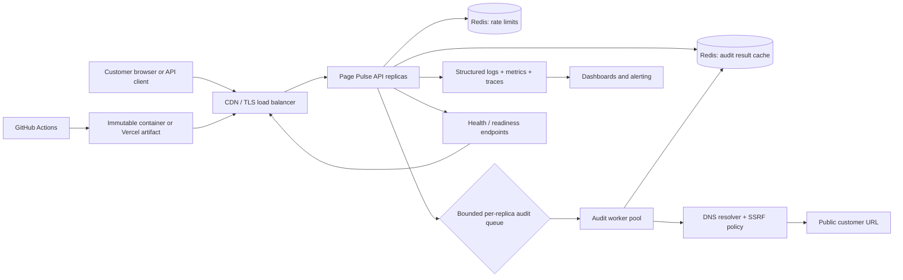

# Page Pulse — Architecture and scale plan

## Scope and service objective

The target is 10,000 audits per day, with bursts of 500 concurrent customer requests. The customer-facing contract is a synchronous `POST /api/audit`: when a result can be produced within the deadline, return it; when the service cannot do reliable work quickly, fail explicitly with `503` or `504` instead of allowing an unbounded queue.

The working SLO for this design is:

- 99.9% of accepted requests return a complete response within 5 seconds.
- p95 API latency below 3 seconds for cache misses under normal upstream conditions.
- p95 cache-hit latency below 100 ms.
- No outbound request is allowed to target a private or special-use address.

Ten thousand audits per day is a modest average (about 0.12 requests/second); the difficult part is the 500-request burst and the fact that the service waits on customer-controlled upstream servers.

## Components and data flow

Request path:

1. The edge terminates TLS and applies coarse WAF/request-body limits. The API derives a client key from the reverse-proxy-aware client IP.
2. The API canonicalizes the URL and checks the shared rate limiter. Invalid and unsafe targets stop here.
3. The API checks Redis for a fresh result. A hit returns immediately with `cache: hit`.
4. A miss enters a bounded local worker queue. A per-key lock or in-flight coalescer means concurrent requests for the same canonical URL share one upstream fetch.
5. The worker resolves the hostname, rejects private/special-use addresses, fetches with manual redirects and an absolute deadline, caps response bytes, and stores a successful result in Redis.
6. The API returns the result or a structured error with the request ID. Logs and metrics are emitted on every branch.

## Queueing strategy

The current repository implementation uses a process-local semaphore and FIFO wait queue. This is the safest no-dependency default: it runs on a laptop, has a hard upper bound, and returns `503 AUDIT_CAPACITY` when the queue is full.

At the target burst, deploy multiple replicas behind the load balancer. Each replica gets a fixed outbound concurrency budget, for example eight replicas × 64 workers = 512 possible upstream fetches. The queue is deliberately bounded rather than sized for every incoming request. A request that cannot enter within the SLA budget receives a retryable `503` with `Retry-After`.

Redis stores the shared cache and rate-limit state. It is not used as a durable job queue for this synchronous contract: adding durable jobs would make the API appear successful while the audit is still pending and would increase tail latency. If a future product needs audits longer than the request SLA, add a separate `POST /api/audit-jobs` returning `202` and a job-status endpoint; do not silently change the synchronous endpoint's meaning.

## Where state lives

| State | Current default | Scaled deployment | Failure behavior |
| --- | --- | --- | --- |
| Request ID, active worker count | Process memory | Process memory | Lost on restart; safe to recreate. |
| Result cache | Bounded TTL/LRU process memory | Redis with TTL and size/eviction policy | Cache miss; never return stale partial data. |
| Rate-limit counters | Process memory | Redis atomic sliding-window/token-bucket script | Prefer fail-closed with `503` if the shared limiter is unavailable. |
| In-flight coalescing | Process memory | Redis short lease per canonical URL plus local coalescing | Duplicate work is acceptable during a lease failure; it must remain bounded. |
| Configuration | Environment / secret manager | Environment / secret manager | Fail deployment readiness if required config is invalid. |
| Logs and metrics | stdout locally | Central collector and metrics backend | Alert on telemetry loss separately from request health. |

## Capacity reasoning

With an upstream timeout of five seconds, a single worker can theoretically complete 0.2 worst-case audits/second. The concurrency budget is therefore the main protection against slow origins, not the daily average. A load test should choose replica count and worker budget from measured upstream latency:

`required concurrent workers ≈ peak accepted requests/second × p95 upstream seconds`

The edge and API must also cap request body size, keep-alive connections, and queue wait time. Autoscaling on CPU alone is insufficient because slow upstreams consume sockets and in-flight slots without necessarily consuming much CPU.

## Deployment shape

CI runs typecheck, tests, and a production build on every push. A production release produces an immutable container/artifact, deploys it as a canary or preview, runs smoke tests against `/healthz`, `/readyz`, and a controlled public URL, then promotes it. The previous artifact remains available for instant rollback.
